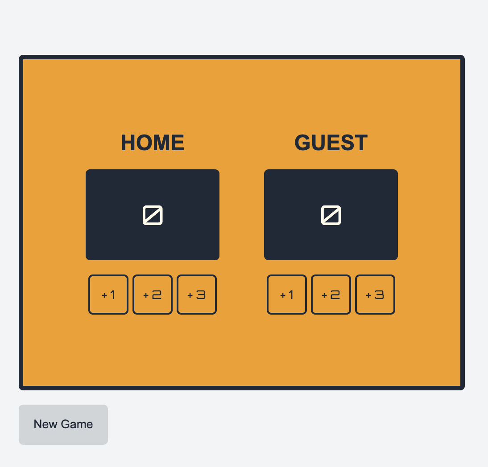

Scoreboard

Description
This JavaScript project is a simple point tracker for two players. It allows users to increment the points of each player using buttons. This project was created to test my understanding of variables and functions in JavaScript, as well as working with the Document Object Model (DOM). This point tracker could be useful for keeping score in a variety of games or competitions.

Screenshot
